How to setup MiniBank in your environment

Jiang Chen (jiangcbj@cn.ibm.com), IBM CICS

12, Nov, 2015

Requirements
============

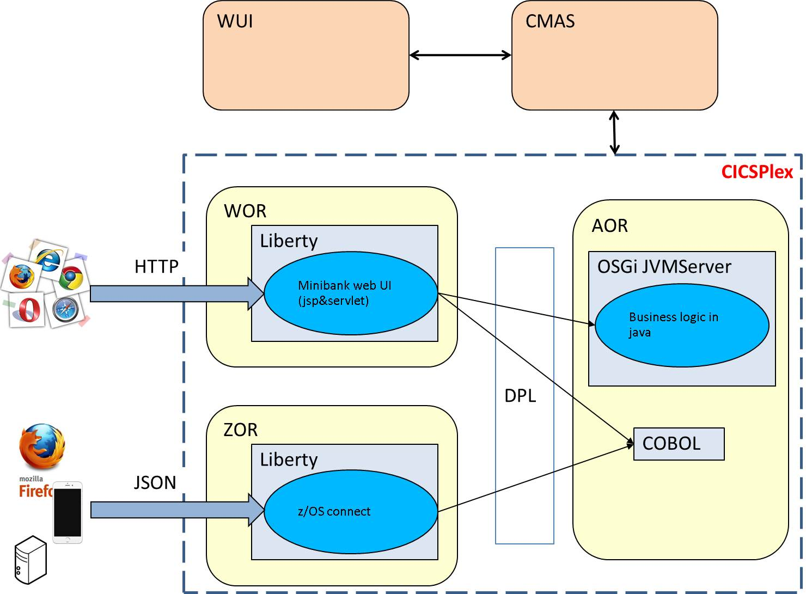

System requirement:
-------------------

1.  We need a CPSM for the Minibank. The requirement for the 5 regions

> CMAS: CICS V5.2 with APAR PI25503, or later
>
> WUI: CICS V5.2 or later
>
> AOR: CICS V5.2 or later
>
> WOR: CICS V5.2 or later
>
> ZOR: CICS V5.2 with APAR PI25503, or later. Please set SEC=YES for this region.
>
> Notes: In this document, we use CICS V5.3

1.  IBM Java SDK��for z/OS�� V7.0 for SR6 (or later)

2.  Eclipse with the CICS Explorer SDK and Websphere Application Server Developer Tool plug-in installed

3.  DB2 for z/OS V10 (or later)

Setup Steps ���1�7 prepare for the environment
=========================================

Get the Minibank sources from the Github
----------------------------------------

1.  You can get all the codes for MiniBank in this link:

> *https://github.com/cicsdev/CICS-Liberty-minibank-example*
>
> 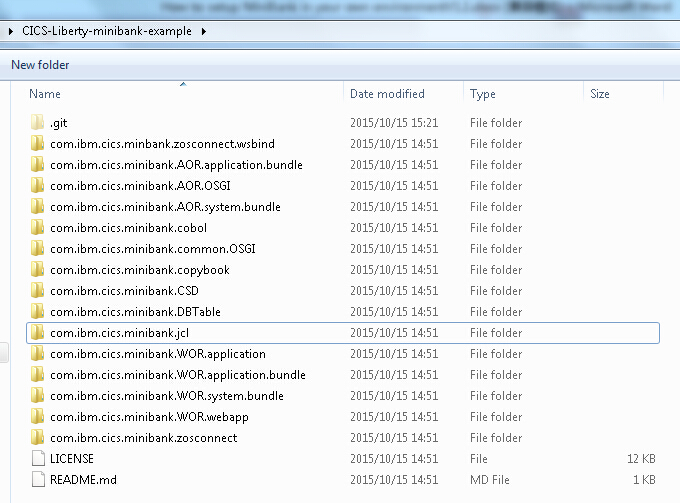

1.  Below is brief introduction on these projects.

> **com.ibm.cics.minibank.AOR.application.bundle:**
>
> CICS bundle project for AOR. Application resource definitions,includes CICS program definitions, OSGI bundles where Java programs reside in.
>
> **com.ibm.cics.minibank.AOR.OSGI :**
>
> OSGI bundle project for AOR. Back-end mini bank Java programs.
>
> **com.ibm.cics.minibank.AOR.system.bundle :**
>
> CICS bundle project for AOR. System resource definitions, Includes CICS transactions, CICS JVMprofile, CICS JVMserver definitions.
>
> **com.ibm.cics.minibank.cobol:**
>
> The source code for the Transfer transaction
>
> **com.ibm.cics.minibank.copybook**
>
> The copybook used in Minibank
>
> **com.ibm.cics.minibank.csd**
>
> The csd for the three regions
>
> **com.ibm.cics.minibank.DBTable**
>
> The jcl to create the tables used in Minibank
>
> **com.ibm.cics.minibank.jcl**
>
> the jcl to generate the files used in zosConnect
>
> **com.ibm.cics.minibank.common.OSGI:**
>
> OSGI bundle project. It is common utility which will be included in both AOR and TOR.
>
> **com.ibm.cics.minibank.WOR.application:**
>
> OSGI application bundle.
>
> **com.ibm.cics.minibank.WOR.application.bundle:**
>
> CICS bundle project for WOR(WOR). Application resource definitions, Includes CICS program definitions. Ebabundle which will run in Liberty server.
>
> **com.ibm.cics.minibank.WOR.system.bundle**
>
> CICS bundle project for WOR(WOR). System resource definitions, Includes CICS transactions, URIMAPs,JVM server and JVMprofile definitions.
>
> **com.ibm.cics.minibank.WOR.webapp:**
>
> Web enabled OSGI bundle project. JSP, java code which will run in Liberty reside here.
>
> **com.ibm.cics.minibank.zosconnect:**
>
> CICS bundle project for zos connect region (ROR). Includes CICS JVMsrever, JVMprofile, Pipeline definitions.

Import the projects to CICS Explorer
------------------------------------

1.  In Eclipse, Open J2EE Perspective and open ���Project Explorer���1�7 view by Windows -&gt; Show view -&gt; Project Explorer., and right-click the blank area in ���Project Explorer���1�7 view and choose ���Import���1�7 in the pop-up menu.

2.  In the pop-up wizard, choose General -&gt; Existing projects into Workplace. You can enter ���Existing projects���1�7 in the input box to easily locate the item. Click Next.

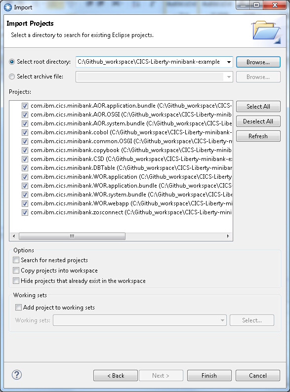

1.  Click the **Browse** button on the right to import the **projects** from the minibank resources you get from Github

> 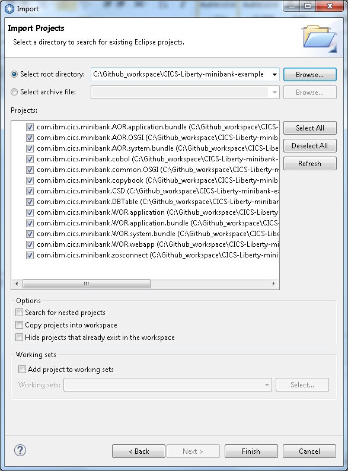

Setup DB2 Related things
------------------------

1.  Please create the DB2 tables using the JCL in the project **com.ibm.cics.minibank.DBTable** ,

> //JOBLIB DD DSN=*SYS2.DB2.V10.SDSNLOAD*,DISP=SHR
>
> LIB('*SYS2.DB2.V10.DSNT.RUNLIB.LOAD*') +
>
> Please change the dataset name to your own environment name.
>
> You can also change the schema name in the JCL. But please remember the schema.

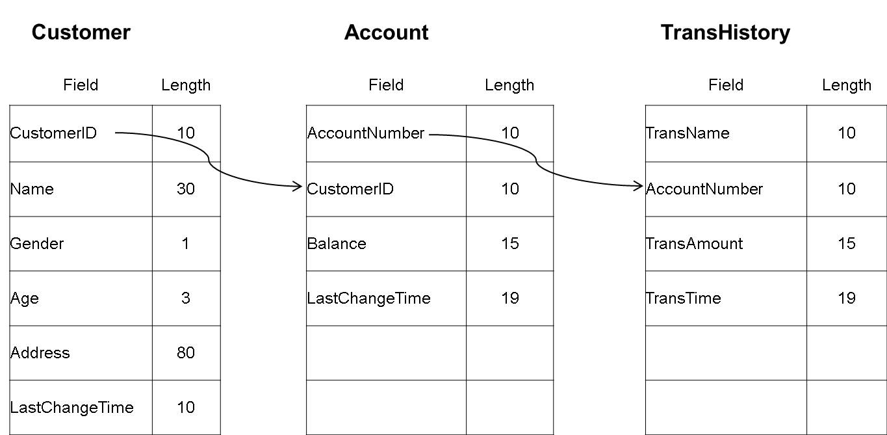

1.  In CICS Explorer, find the file MinibankAOR.properties in the project com.ibm.cics.minibank.AOR.OSGI by open the src/properties.

> Change YANFENG to your schema name. Then save it.
>
> \#\#\#\#\#\#\#\#\#\#\#\#\#\#\#\#\#\#\#\#\#\#\#\#\#\#\#\#\#\#\#\#\#\#\#\#\#\#\#\#\#\#\#\#\#\#\#\#\#\#
>
> \# DB2 table names
>
> \#\#\#\#\#\#\#\#\#\#\#\#\#\#\#\#\#\#\#\#\#\#\#\#\#\#\#\#\#\#\#\#\#\#\#\#\#\#\#\#\#\#\#\#\#\#\#\#\#\#
>
> TABLE\_CUSTOMER=YANFENG.CUSTOMER
>
> TABLE\_ACCOUNT=YANFENG.ACCOUNT
>
> TABLE\_TRANHIST=YANFENG.TRANSHISTORY

1.  In CICS Explorer, find the file MinibankWOR.properties in the project com.ibm.cics.minibank.WOR.webapp by open the src/properties.

> Change XIAOPING to your schema name. Then save it.

\#\#\#\#\#\#\#\#\#\#\#\#\#\#\#\#\#\#\#\#\#\#\#\#\#\#\#\#\#\#\#\#\#\#\#\#\#\#\#\#\#\#\#\#\#\#\#\#\#\#

\# DB2 table names

\#\#\#\#\#\#\#\#\#\#\#\#\#\#\#\#\#\#\#\#\#\#\#\#\#\#\#\#\#\#\#\#\#\#\#\#\#\#\#\#\#\#\#\#\#\#\#\#\#\#

> TABLE\_REQHISTORY=XIAOPING.REQHISTORY

1.  Setup DB2CONN in your AOR region, set the DB2ID of your DB2 system, then install and connect the DB2CONN

Compile the COBOL program
-------------------------

1.  Please compile the cobol program in the project **com.ibm.cics.minibank.cobol**. Please remember the load dataset name of the cobol program.

2.  Find the MINIBANK.library file in project com.ibm.cics.minibank.AOR.application.bundle.Change the value of DSNAME01 to the cobol program���s load dataset name.

Setup JVMServer
---------------

1.  In CICS Explorer, find the file DFHOSGI.jvmprofile in the project com.ibm.cics.minibank.AOR.system.bundle.

> Change the values of the below keys to your own values.
>
> *WORK\_DIR=/u/cntest7/liberty/workdir*
>
> *JAVA\_HOME=/java/J7.0\_64*
>
> *LIBPATH\_SUFFIX=/usr/lpp/db2v10/jdbc/lib/*
>
> *OSGI\_BUNDLES=/usr/lpp/db2v10/jdbc/classes/db2jcc4.jar,\\ *
>
> */usr/lpp/db2v10/jdbc/classes/db2jcc\_license\_cisuz.jar*

1.  In CICS Explorer, find the file DFHWLP.jvmprofile in the project com.ibm.cics.minibank.WOR.system.bundle.

> Change the values of the below keys to your own values.

*WORK\_DIR=/u/cntest7/liberty/workdir*

*JAVA\_HOME=/java/J7.0\_64*

*LIBPATH\_SUFFIX=/usr/lpp/db2v10/jdbc/lib/*

*-Dcom.ibm.cics.jvmserver.wlp.server.http.port=30095*

*-Dcom.ibm.cics.jvmserver.wlp.server.https.port=30096*

*-Dcom.ibm.cics.jvmserver.wlp.server.host=winmvs2d.hursley.ibm.com*

1.  In CICS Explorer, find the file DFHWLP.jvmprofile in the project com.ibm.cics.minibank.zosconnect.

> Change the values of the below keys to your own values.

*WORK\_DIR=/u/cntest7/liberty/workdir*

*JAVA\_HOME=/java/J7.0\_64*

*-Dcom.ibm.cics.jvmserver.wlp.server.http.port=30095*

*-Dcom.ibm.cics.jvmserver.wlp.server.https.port=30096*

*-Dcom.ibm.cics.jvmserver.wlp.server.host=winmvs2d.hursley.ibm.com*

Generate the WSBind file
------------------------

1.  Upload the file TRANSFER in the project **com.ibm.cics.minibank.copybook** to a dataset, the JCL will use the copybook to generate wsbind, schemas used in zosConnect lab. You can also copy the file content to a dataset member

2.  Upload the file LS2JS.jcl in the project **com.ibm.cics.minibank.jcl** to a dataset, or copy the file content to a dataset member.

> Update the red places. Please create the uss directory used in the JCL.
>
> /u/amilybj/zosConnect/ls2js/log/
>
> /u/amilybj/zosConnect/ls2js/wsbind/
>
> /u/amilybj/zosConnect/ls2js/schema/
>
> //L2JB02 JOB (MYSYS,AUSER),MSGCLASS=H,
>
> // CLASS=A,NOTIFY=&SYSUID,REGION=0M
>
> //LS2JS JCLLIB ORDER=(ANTZ.CICS.TS.DEV.INTEGRAT.SDFHINST)
>
> //WSBIND EXEC DFHLS2JS,
>
> // JAVADIR='/java/java71\_bit64\_sr1/J7.1\_64',
>
> // USSDIR='devint',
>
> // PATHPREF='',
>
> // TMPDIR='/tmp',
>
> // TMPFILE='l'
>
> //INPUT.SYSUT1 DD \*
>
> LOGFILE=/u/amilybj/zosConnect/ls2js/log/ls2js.log
>
> PDSLIB=//AMILYBJ.CICS.MINIBANK
>
> REQMEM=TRANSFER
>
> RESPMEM=TRANSFER
>
> LANG=COBOL
>
> WSBIND=/u/amilybj/zosConnect/ls2js/wsbind/trasferJSON.wsbind
>
> JSON-SCHEMA-REQUEST=/u/amilybj/zosConnect/ls2js/schema/transfQ.json
>
> JSON-SCHEMA-RESPONSE=/u/amilybj/zosConnect/ls2js/schema/transfP.json
>
> MAPPING-LEVEL=3.0
>
> PGMNAME=TRANSFER
>
> PGMINT=COMMAREA
>
> URI=/minibankAPI/transfer
>
> DATETIME=PACKED15
>
> SYNCONRETURN=YES
>
> CCSID=935
>
> /\*

1.  Submit the JCL and get MACC=0

2.  In the project **com.ibm.cics.minibank.zosconnect,** update the file ZOSCONN.pipeline

> *wsdir*="/u/*yanfeng*/zosConnect/ls2js/*wsbind*". Change the ussdir to the uss dir you used in the JCL.

Use CICS Explorer to deploy Minibank
====================================

Export the projects to USS
--------------------------

> Before this step, make sure you have configured FTP connection to MVS and configured CMCI connection to MVS. If not, reference Appendix B.
>
> Make sure you have setup the target platform, reference to Appendix A.
>
> A CICS bundle is a collection of resources, artifacts, references, and a manifest file that you can deploy into a CICS region to represent all or part of an application. In this step, you need to upload the below four CICS bundle projects to USS.

**com.ibm.cics.minibank.AOR.application.bundle;**

**com.ibm.cics.minibank.AOR.system.bundle ;**

**com.ibm.cics.minibank.WOR.application.bundle;**

**com.ibm.cics.minibank.WOR.system.bundle;**

1.  Right click the **com.ibm.cics.minibank.AOR.application.bundle,** choose the menu ���Export Bundle Project to z/OS UNIX File System�����1�7�1�7

2.  Select the ���Export to specific location in the file system���1�7

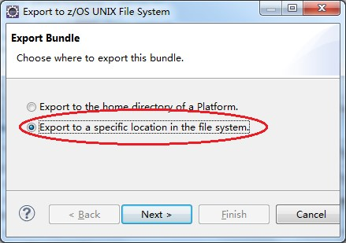

Enter your USS folder **(/u/ \*\***) as Parent Directory to export the bundle. It does not matter the directory is not there because the tool will create one for you. if you already have old content in the folder, for example the old version of the bundle, you can enable the check box ���Clear existing contents of Bundle directory���1�7 to clean the folder before exporting. Click **Finish** to export the **com.ibm.cics.minibank.AOR.application.bundle** bundle.

1.  After you press finish, you will see the similar output like:(*note: please record down the bundle directory before you press Finish, it will be used later when you define the bundle resource*)

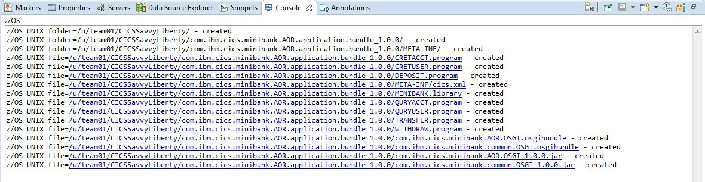

4. Repeat step 1-3 to upload below left 3 bundle projects.

**com.ibm.cics.minibank.AOR.system.bundle ;**

**com.ibm.cics.minibank.WOR.application.bundle;**

**com.ibm.cics.minibank.WOR.system.bundle;**

Define system connections
-------------------------

WOR &lt;-&gt; AOR used for Minibank

ZOR &lt;-&gt; AOR used for zosConnect

### Create resource group definition

1.  In the CICS SM perspective, click Window-&gt;Show View -&gt; Other.., input res, then choose resource group definition, click OK.

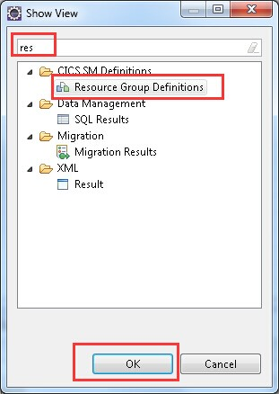

1.  In the resource group view, right click the blank area, then click new.

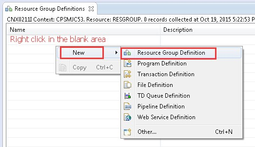

1.  Input the group name and description

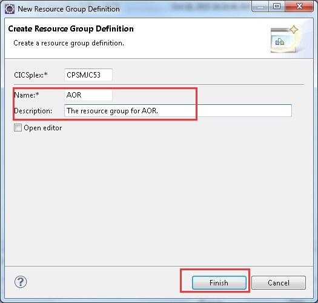

1.  Repeat the 1~3 steps to add other three group, WOR, ZOR. After thEse steps, you can see 3 groups.

### Create TCPIPService

1.  In the CICS SM perspective, click Definitions-&gt; TCP/IP Service Definitions

2.  Right click the blank area in the I TCP/IP Service Definitions, then click new

3.  Input the group, name, description port number and choose IPIC in the protocol, then click finish.

> 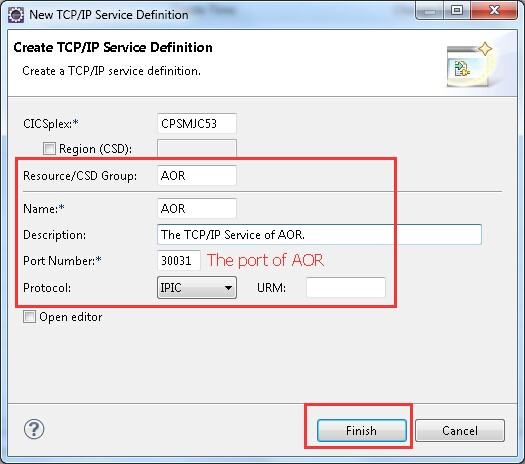

1.  Repeat the 2~3 steps to add other three connections, please note:

> ZOR: GROUP(ZOR), Port(The port of the ZOR)
>
> WOR: GROUP(WOR), Port(The port of the WOR)

### Create IPIC Connection

1.  In the CICS SM perspective, click Definitions-&gt; IPIC Connection Definitions

2.  Right click the blank area in the IPIC Connection Definitions, then click new

3.  Input the attributes as the picture showed.

> 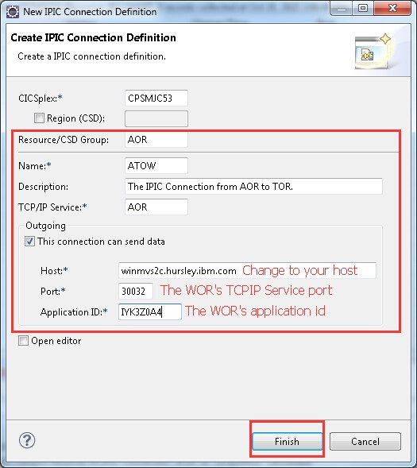

1.  Double the ATOW to open the editor, change the AUTOCONNECT to YES

> 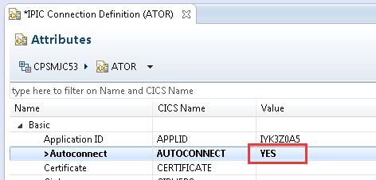

1.  Repeat the 2~4 steps to add other three sessions: WTOA, ATOR, RTOA. Don���t forget to change the AUTOCONNECT to YES.

> 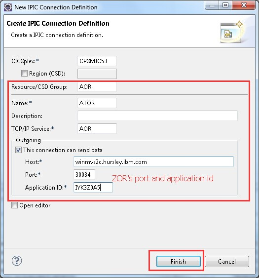
>
> 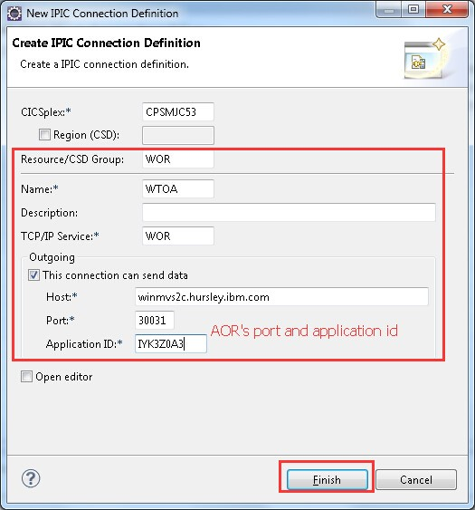
>
> 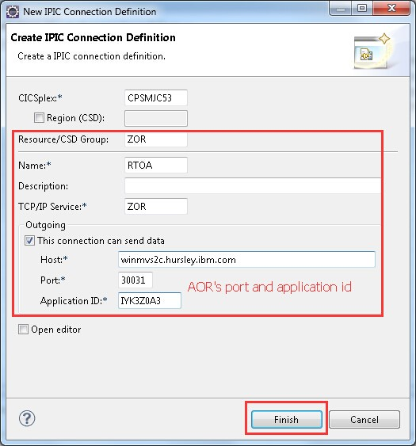

### Install the resource group

1.  In the Resource Group Definitions View, right the AOR, then click the Install. Select the AOR region, then click OK.

> 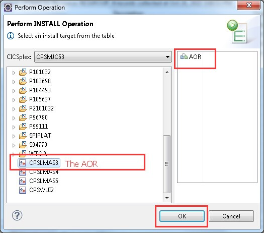

1.  Install WOR and ZOR resource group to the right region.

2.  Click Operations -&gt; IPIC Connection. If you can���t see data, please click the CPSM name in the left. You can also click the refresh button to get the latest data.

> 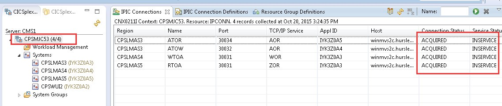

Define resources for WOR and AOR
--------------------------------

Before define resources, you need to set up CMCI connection to your CPSM environment. If not, please refer to Appendix B.

All bundle artifacts are at USS now. In this step, you need to define and install CICS bundle resource by CICS explorer.

-   For WOR:

    -   BUNDLE: WAPPBUND ���1�7 for WORapplication bundle

    -   BUNDLE: WSYSBUND ���1�7 for WORsystem bundle

-   For AOR:

    -   BUNDLE: AAPPBUND ���1�7 for AOR application bundle

    -   BUNDLE: ASYSBUND ���1�7 for AOR system bundle

.

1.  Open perspective and choose **CICS SM**.

1.  Go to Definitions -&gt; Bundle Definitions

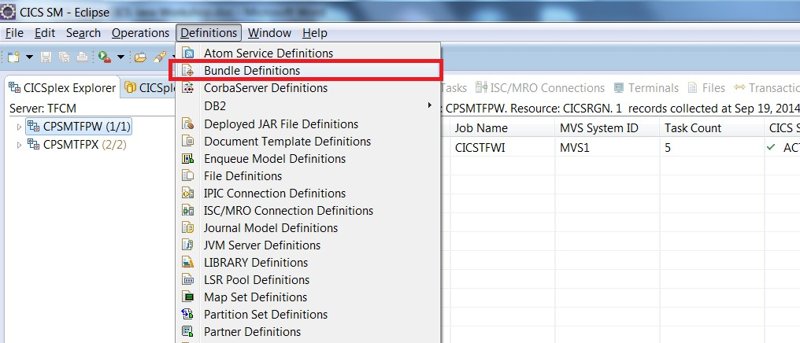

1.  Click ***CPSMxxPX*** in CICSplex Explorer, it will be the CONTEXT for the resource definitions.

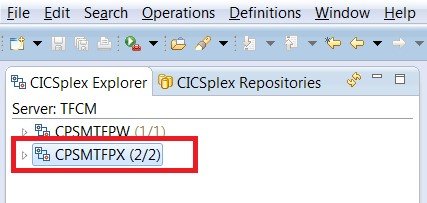

1.  Right-click the empty area, and press New.

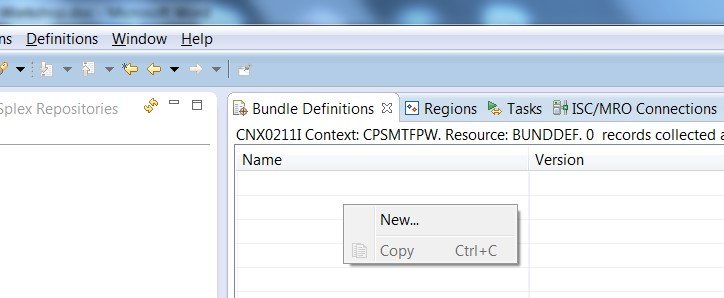

1.  Input Name and Bundle Directory for the definition. (*note: Bundle Directory is the directory where you uploaded your Bundle project in USS*)

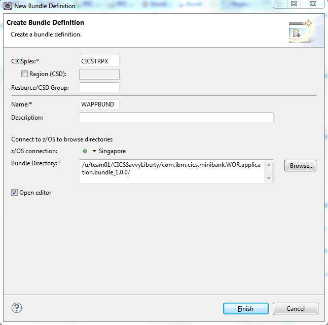

1.  Repeat step 4-5 to recreate bundle definitions for other three bundles, and finally you will have four bundle definitions.

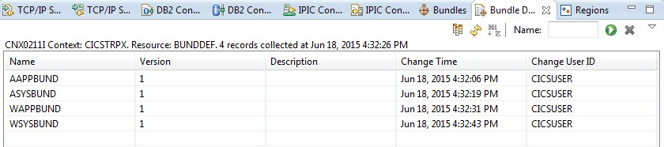

1.  Install BUNDLE definitions WSYSBUND to WOR. Firstly, right-click on WSYSBUND, and press Install.

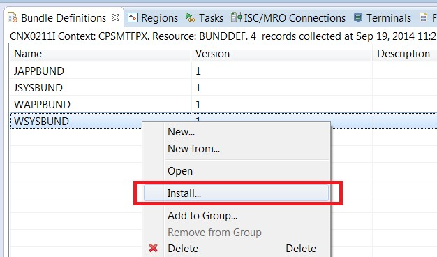

1.  Select the target region, WOR REGION

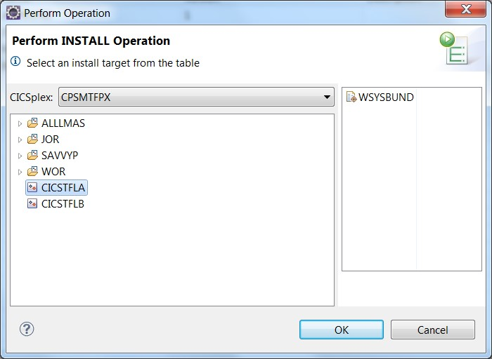

1.  Repeat step 7-8 to install below bundles **in sequence**:

-   WAPPBUND to WOR REGION.

-   ASYSBUND to AOR REGION.

-   AAPPBUND to AOR REGION.

> Finally, you have four bundle definitions installed, two for WOR REGION, and two for AOR REGION.

1.  Click Operations -&gt; Bundle to review all the bundles installed on the system. You will be able to see:

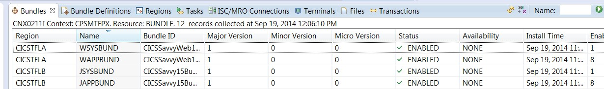

Following resources were already setup, please check if they are installed correctly.

1.  Go to Operations -&gt; DB2 -&gt; DB2 Connections, and check the DB2 definition status. Right-click on it and press Connect.

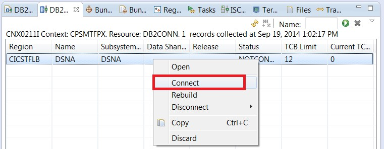

Update configurations to support JDBC Type 4:
---------------------------------------------

We need to update one file to support security and JDBC type 4 in .

1.  Open Perspective z/OS

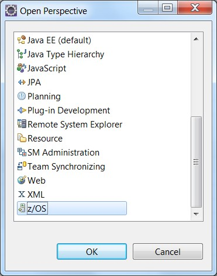

1.  In z/OS UNIX Files view,

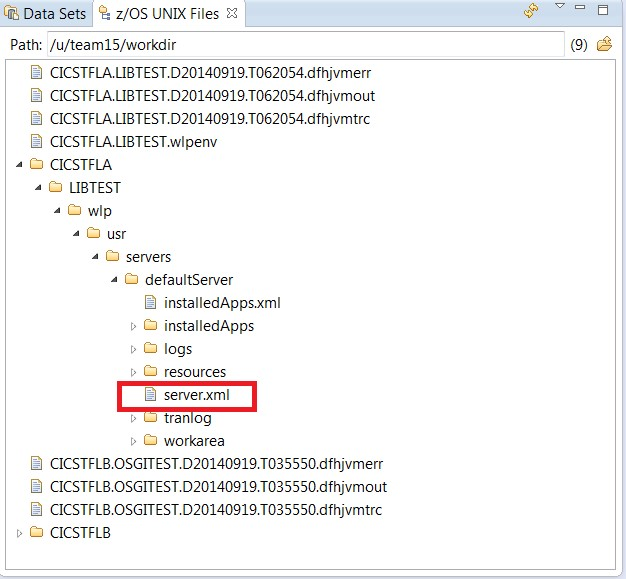

3. Set server.xml property to **binary** for FTP save purpose, binary transfer won���t corrupt the data format. Right click on server.xml, then click on Properties, change transfer mode to Binary. Save ���OK���1�7.

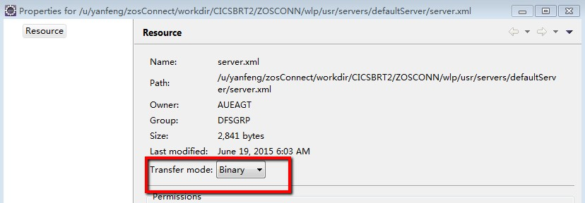

1.  You can copy and paste the following parts to your server.xml

-   Add new feature to feature manager

> *&lt;feature&gt;jdbc-4.0&lt;/feature&gt;*

-   Add the following data source and library to support JDBC type 4

> **Change the databasename, serverName, portNumber, user and password.**
>
> **Change the db2 library directory.**
>
> *&lt;dataSource jndiName="jdbc/CICSType4DataSource"&gt;*
>
> *&lt;jdbcDriver libraryRef="db2jdbc4Lib"/&gt;*
>
> *&lt;properties.db2.jcc databaseName="TSTDB202" driverType="4" password="{xor}NW4+LDduLjY=" portNumber="448" serverName="192.168.42.79" user="YANFENG"/&gt;*
>
> *&lt;/dataSource&gt;*
>
> *&lt;library id="db2jdbc4Lib"&gt;*
>
> *&lt;fileset dir="/usr/lpp/db2/db2a10/jdbc/classes" includes="db2jcc4.jar db2jcc\_license\_cisuz.jar"/&gt;*
>
> *&lt;fileset dir="/usr/lpp/db2/db2a10/jdbc/lib"/&gt;*
>
> *&lt;/library&gt;*

Run Mini Bank programs:
-----------------------

Mini bank is Web based applications as we deployed in above steps. We will expose one of its programs as JSON web services in zos connect in late part of this workshop. Now you can play with mini bank. Have a fun!

### Visit the Liberty program with URL

Go to [*http://your*](http://your/) host:&lt;your http port for the WOR liberty &gt;/Minibank/toMenuPage.action. It will get page as below.

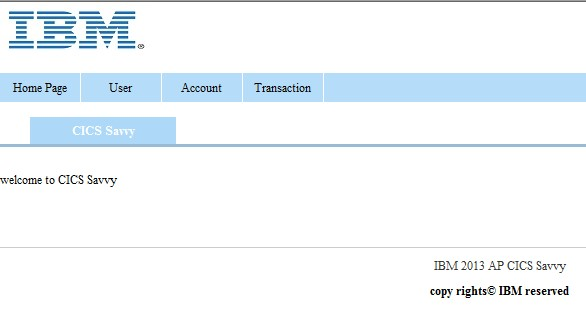

Click the User, Account, Transaction, you will get drop-down menu. From the menu you can run the operations.

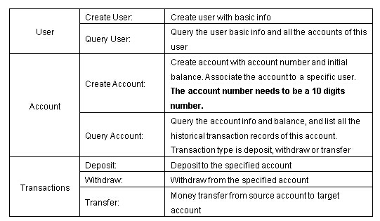

Set up CICS zosConnect support in ROR
-------------------------------------

***Brief introduction:***

*To enable zosConnect feature in CICS, we need to set up a Liberty JVMserver. It is a good practice to configure a separate JVM server for the sole use of z/OS Connect. It is also a good practice to only have a single WebSphere Liberty Profile JVM server that is configured in any single CICS region, so we use a new TOR to host the service (ROR REGION).*

*A pipeline resource is also needed to set up the JSON webservice for program ���TRANSFER���1�7. We had prepared the program ���TRANSFER���1�7 in AOR and wsbind file for the pipeline resource. You can just use the created materials. *

*We packaged all the required resources into one CICS bundle project called ���1�7**com.ibm.cics.minibank.zosconnect**���1�7 which you already imported in page 3, follow below instructions to finish setting up your first zosConnect environment.*

### Check the project is exported

Follow the instruction in Page 5. Make sure your **com.ibm.cics.minibank.zosconnect** project is exported to HFS, like the screenshot below:

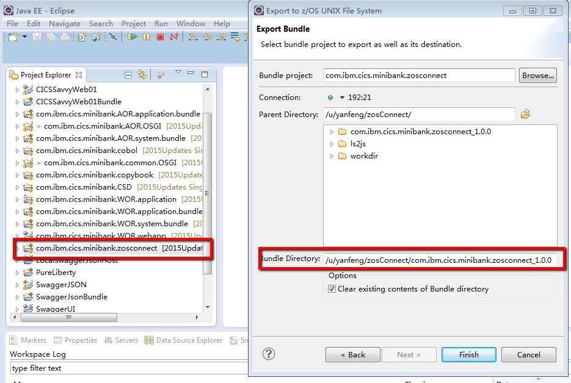

Do not forget to copy the ���Bundle Directory���1�7 where you upload the bundle files, this directory will be used in next step for bundle definition.

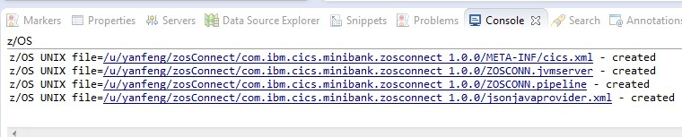

Check the export is successful.

### Define bundle resource for Liberty server and pipeline

1. Make sure your CICS Explorer can connect to your CPSM environment with CMCI connection.

Select 'Definitions-&gt; Bundle Definition' from menu.

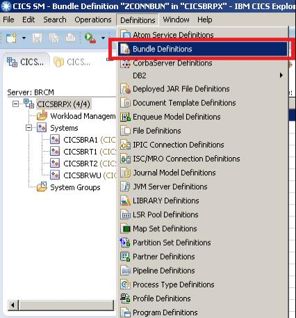

2. Right click the 'Bundle Definition' view and select 'New...' to startup Bundle definition wizard. You need give bundle definition a name ���1�7**ZCONNBUN**���1�7 and change **bundle directory** the folder where you exported the bundle project under your USS folder.

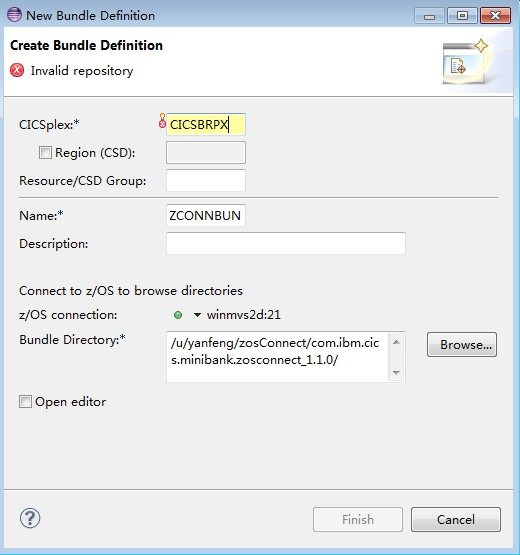

3. Right click the new created 'Bundle Definition' and select 'Install' item to install it into your second TOR **ROR REGION**.

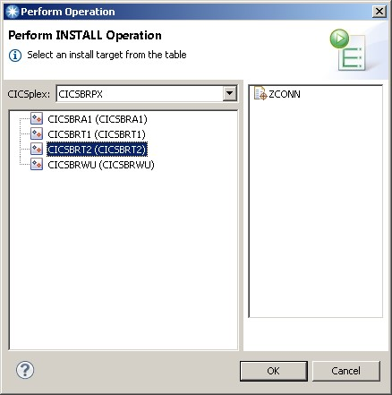

4. You can verify the installed bundle enabled in your ROR by select 'Operations-&gt; Bundle' from CICS Explorer menu.

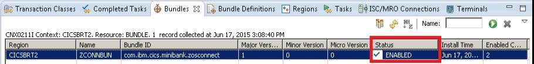

5. Connection between ROR to AOR is installed in advance. Go to Operations-&gt;ISC/MRO connections, check your ROR to AOR connection is in acquired status.

***What���s contained in this bundle?***

-   *One JVMserver as zosConnect service host*

-   *One pipeline resource for the json webservice. The wsbind file referenced in pipeline is generated from DFHLS2JS utility.*

-   *A remote program ���TRANSFER���1�7, which is the end program to provide the function logic.*

### Customize server.xml to enable zosConnect feature

1. Switch to 'z/OS' perspective in CICS Explorer.

2. Locate the Liberty server.xml under your WORKDIR. The Liberty server.xml will under:

���1�7*/u/ \*\*/zosConnect/workdir/ROR REGION/ZOSCONN/wlp/usr/servers/defaultServer*���1�7. Please replace \*\* with your team number.

3. Set server.xml property to **binary** for FTP save purpose, binary transfer won���t corrupt the data format. Right click on server.xml, then click on Properties, change transfer mode to Binary. Save ���OK���1�7.

4. Open server.xml by double click:

Copy the following statements in yellow highlight to your server.xml

Add support for zosConnect feature in liberty featureManager section.
cicsts:zosConnect-1.0
ssl-1.0
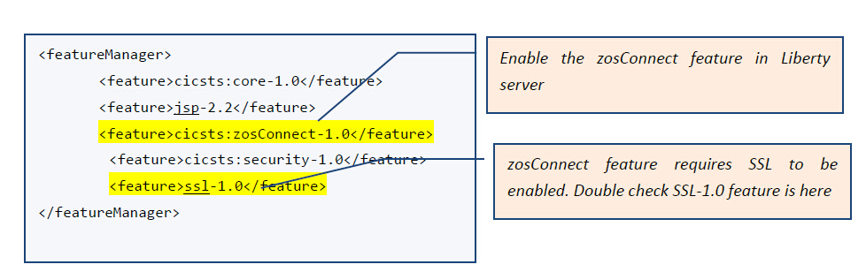

Add following statements under featureManager tag.
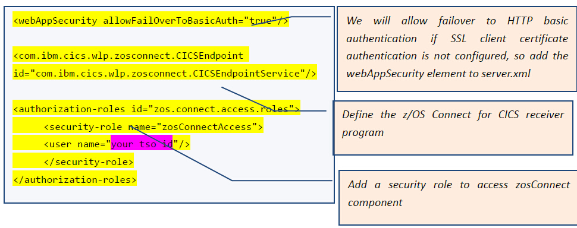

5. Save your server.xml. You should get a file like the following example:

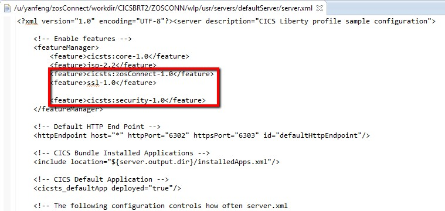

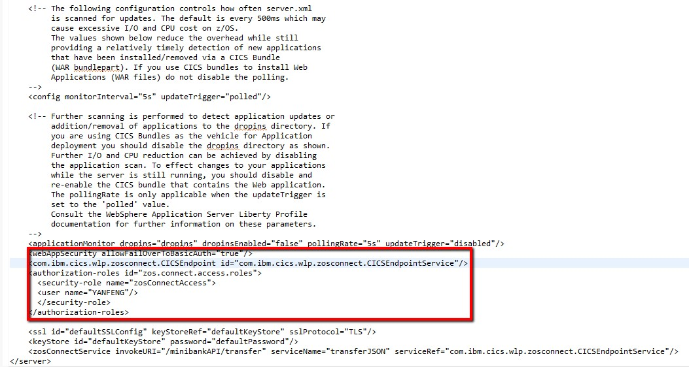

6. Check log for zosConnect feature enabled message. Find your liberty server log: The directory should be ���1�7*/u/team\*\*/zosConnect/workdir/ROR REGION/ZOSCONN/*���1�7. Example in following picture:

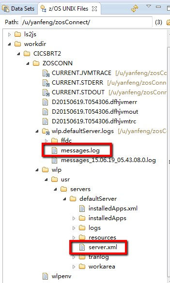

Open message.log file, you should get

���1�7**Web Module z/OS Connect has been bound to default\_host���1�7** message printed indicating the z/OS Connect feature is successfully deployed.

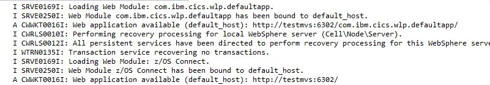

7. Add the TRANSFER service to server.xml. We have created a pipeline resource in the bundle. This pipeline creates a ���transferJSON���1�7 webservice in our CICS region, we need to register this service to zosConnect.

Still open server.xml, add the following statements

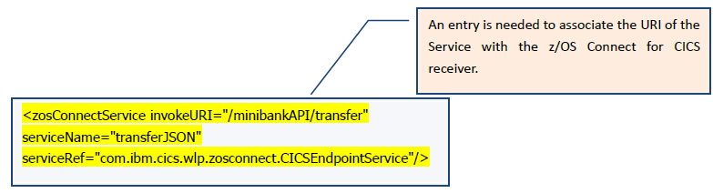

8. Check the ���transferJSON���1�7 service is successfully deployed. Go to your browser (don���t forget to change the port):

this link can help you to list all available services in this server.

From browser, if there is certificate exception, accept certificate exception.

If a pop up window requires userid and pwd, specify your credential (TEAM\*\*) specified in the security role (Note, the **userid is case sensitive,** you need to keep consistent with the ID your specified in server.xml security role)

Then you should get:

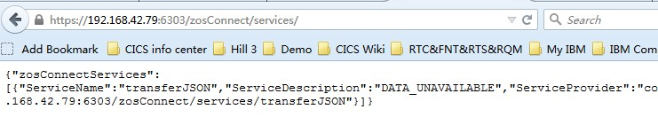

Congratulations!

The service is already registered and can be used now.

### Optional: Test the transferJSON API service.

1. We will use Firefox add-on ���RESTClient���1�7 to do the testing. If you have similar tools can send HTTP rest request, you can change to use your own one.

Search in Firefox Add-On lib, install ���RESTClient���1�7, after install and restart, it should be like this:

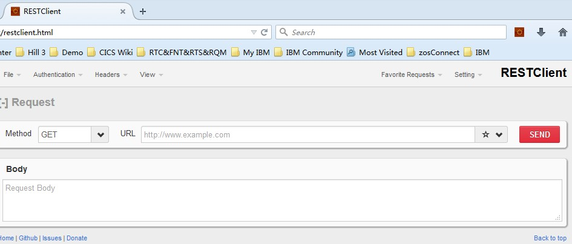

2. Config parameters:

Method: POST

URL: https://your host:<Your zosConnect jvmserver https port, 6**5>/minibankAPI/transfer

(Replace your own HTTPS port)

Body: Give the following JSON data.

(Note: the account number need to be created first, use the number we provide is advised)

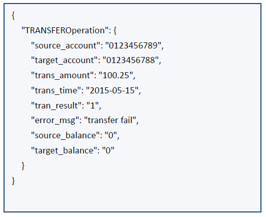

Specify Basic Authentication and content-type Header:

You need input your MVS ID/PWD as basic authorization.

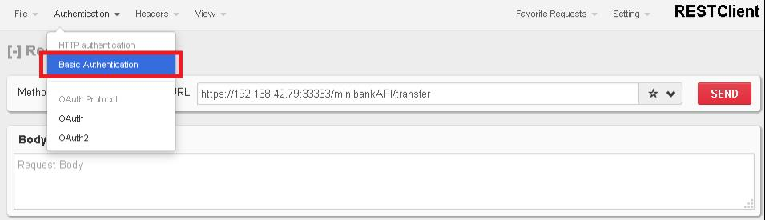

Add JSON content-type header into request in RESTClient as below:

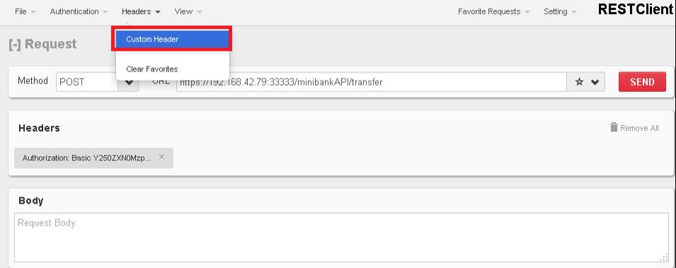

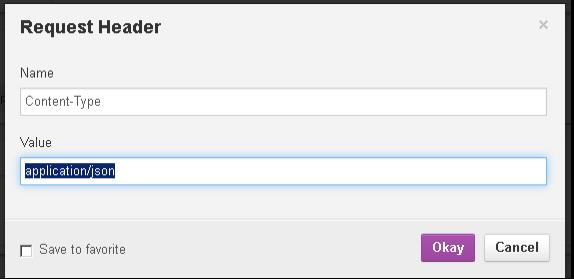

3. Test! Press SEND button. You should get:

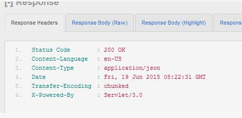

Check ���Response Body���1�7

You should get ���TRNSFER SUCCESSFULLY���1�7 result.

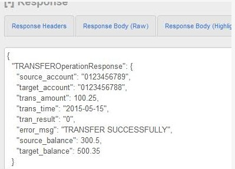

***Congratulations! ***

Disclaimer
==========

This document is not part of any standard IBM product and is provided to you solely for assisting you in setting up the application. IBM shall not be liable for any damages arising out of your use of the document.

Appendix A: Set up Eclipse with CICS Explore SDK for CICS Java development
==========================================================================

### Setup JRE

1.  Go to ���Window -&gt; Preferences -&gt; Java -&gt; Installed JREs���1�7, to add a JRE definition pointing to your local JRE folder. Please note this workshop need JRE 1.7. Like below:

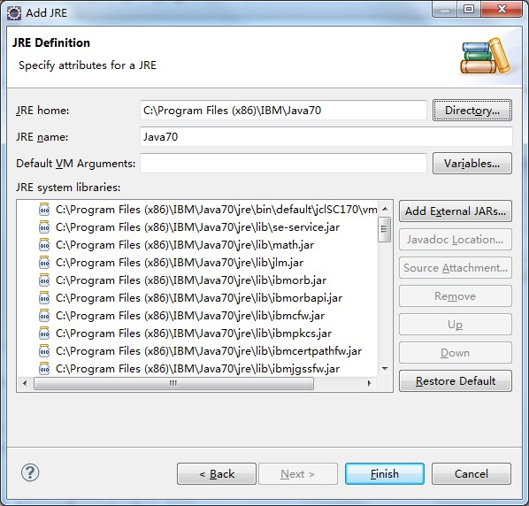

1.  Click the ���Finish���1�7 button and you will see the JVM named Java70 been added to the available JVM list:

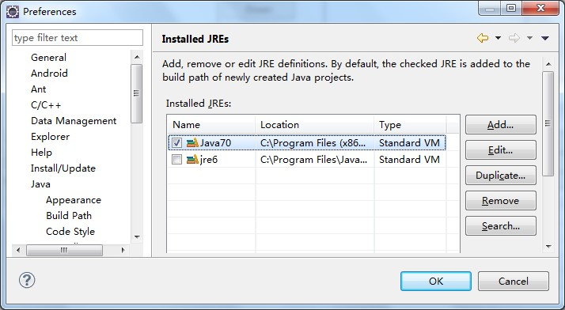

> Click the **Java70 JVM** and click ���1�7**OK**���1�7 button

### Setup Plug-in Target Platform

1.  Go to ���Window -&gt; Preferences���1�7, in the left list, jump to ���Plug-in Development -&gt; Target Platform���1�7, click ���Add���1�7

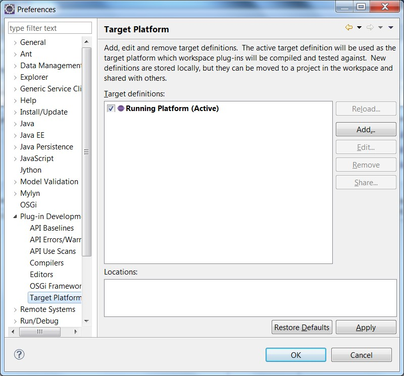

1.  Select ���Template���1�7, in the drop-down list, and select ���CICS TS V5.3 with Liberty and PHP���1�7, click Next and then Finish to close the Target Definition window.

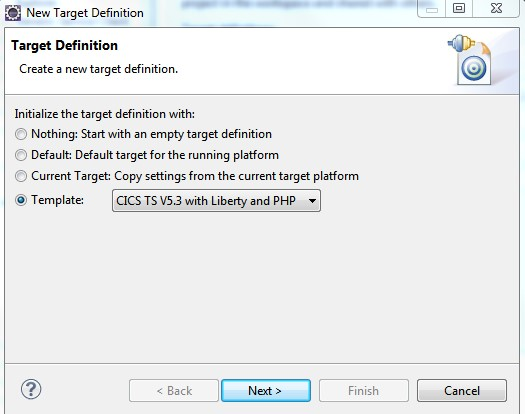

You will see:

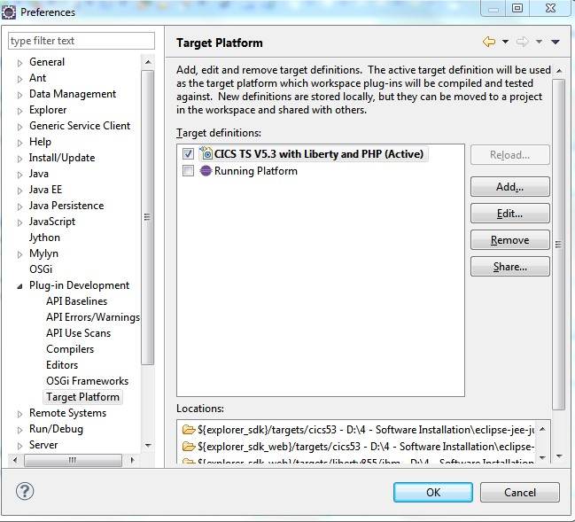

1.  **Click the ���CICS TS V5.3 with Liberty and PHP���1�7 to active it**, and then click OK to exit the Preference window.

Appendix B: Set up connection between CICS Explorer and mainframe for the workshop
==================================================================================

To support this workshop, you need to set up two types of connection for CICS Explorer:

1.  z/OS FTP connection

2.  CMCI connection

### Configure FTP connection to MVS

1.  Here we need to establish a FTP connection to MVS so that we can easily deploy CICS bundles into MVS USS. In Eclipse, go to Window -&gt; Show View -&gt; Other -&gt; Host Connections

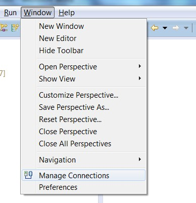

You will see the Host Connection view as below:

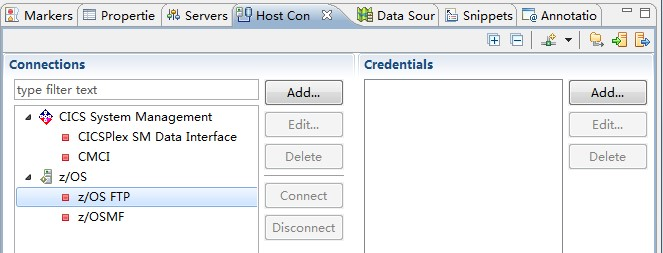

1.  Select the z/OS FTP, and click the Add button to configure the z/OS FTP connection to 192.168.42.79:

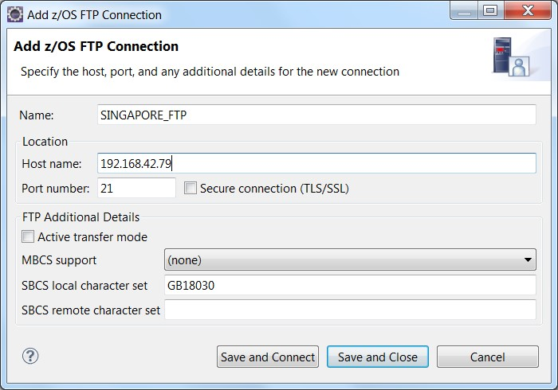

1.  Click ���Save and Close���1�7, in the list you can see a z/OS FTP connection configuration is created:

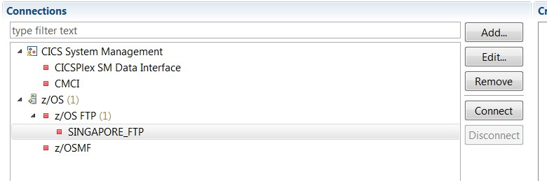

1.  In the Credentials panel, click Add button to add a credential to connect MVS:

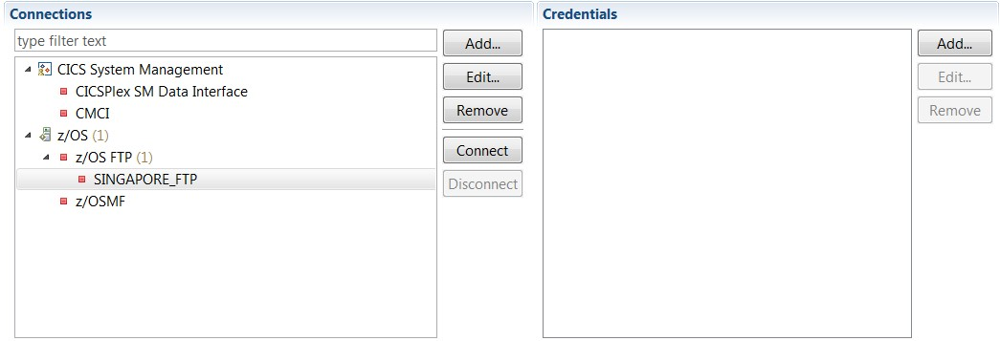

Click **OK** to create the credential.

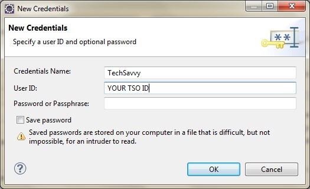

1.  Connect to the 192.168.42.79 using your credential:

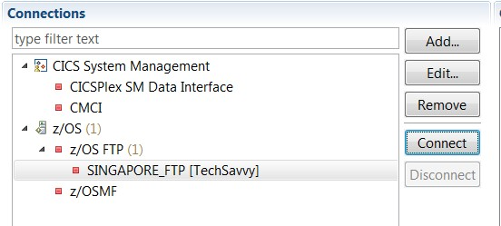

Using the credential we just created to connect to MVS

1.  If successfully connected, you will see the TechSavvy connection turns to green and Connect button turns Gray:

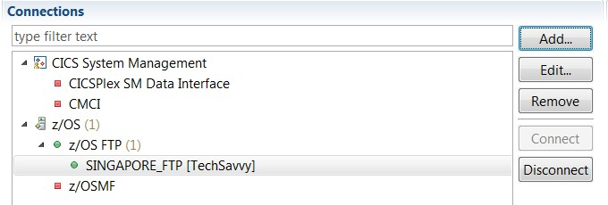

### Configure CMCI connection to MVS

1.  Select CMCI as connection type, and press Add.

> 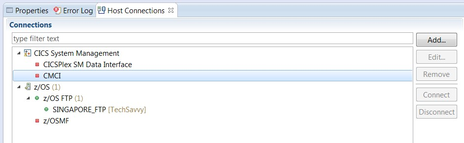

1.  Input Name, Host name and port number. This port number is CMCIPORT (6\*\*1)assigned for your WUI region.

> 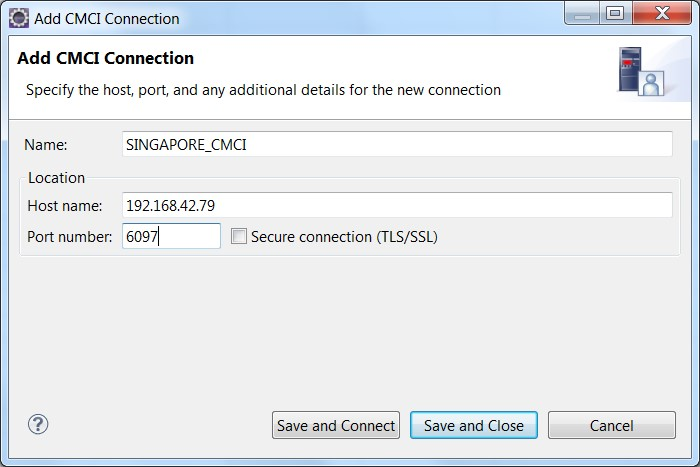

1.  Save and connect using your own credential. You will be able to see the CMCI connection is configured successfully.

> 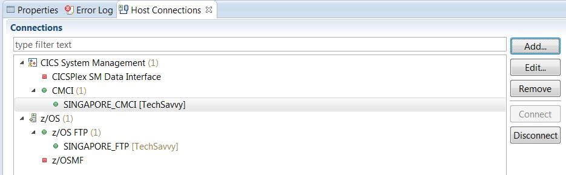
